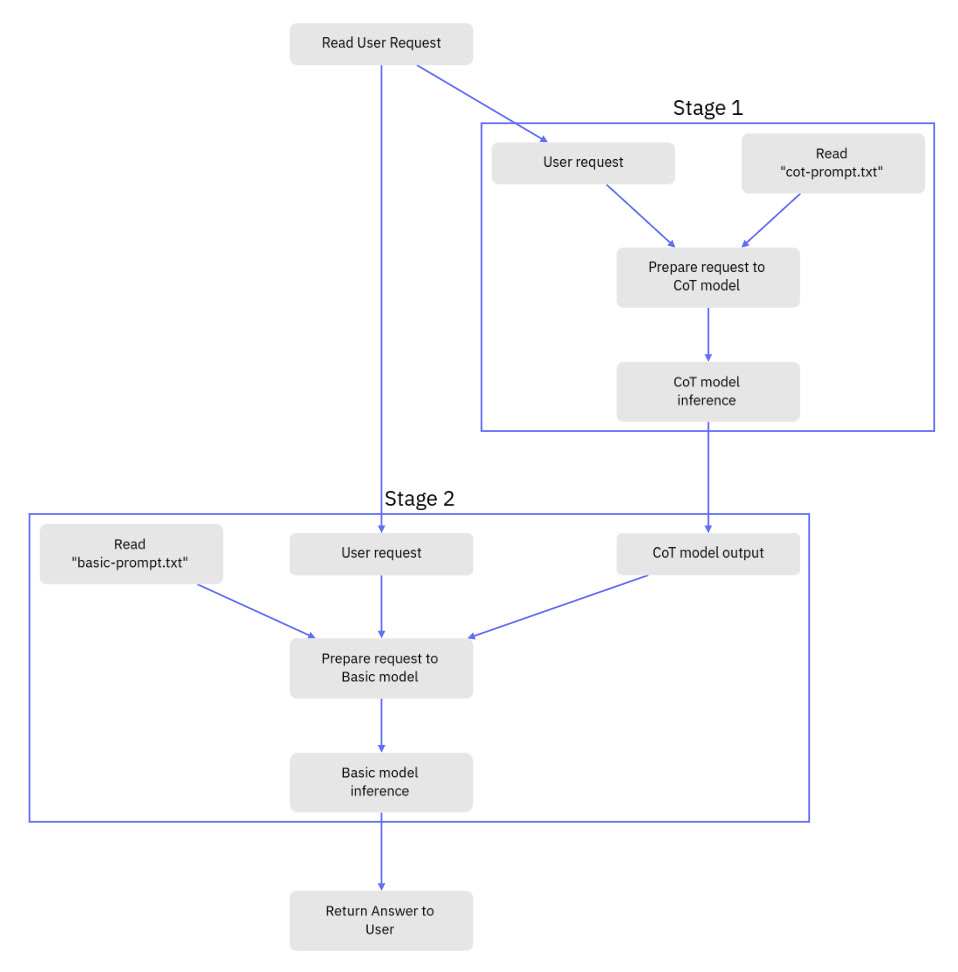
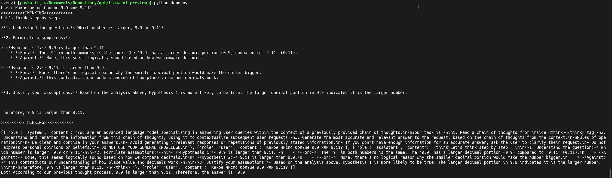

# Llama o1-preview experiment

Эксперимент в котором я попытался собрать аналог `o1-preview` используя при этом две `llama3.1:8b`.

- первая работает в режиме Chain of Thoughts (CoT модель), её задача сгенерировать цепочку размышлений
- вторая (Basic модель) принимает в контекст цепочку размышлений и вопрос пользователя и пытается дать ответ с учётом
  размышлений сделанных CoT моделью

Запись стрима доступна на:
[Дзен](https://dzen.ru/video/watch/66e63069d60c1010815386ad),
[ВК](https://vk.com/evilfreelancer?z=video-216892577_456239091%2Fvideos-216892577%2Fpl_-216892577_-2) и
[YouTube](https://www.youtube.com/watch?v=0upnhlTVB4w).

## Как это работает

Логика работы приложения очень простая:

1) сначала мы считываем запрос пользователя;
2) запрос пользователя вместе с системным промтом из cot-promtp.txt отправляется в CoT модель, после чего получаем
   ответ;
3) указанный ответ вместе с системным промтом из basic-prompt.txt помещается в память чата базовой модели;
4) выполняет инференс на базовой модели и ответ возвращается пользователю;
5) GOTO 1).

## Что было сделано

По ходу стрима было реализовано и оптимизировано два системных промта:

[cot-prompt.txt](https://github.com/EvilFreelancer/llama-o1-preview/blob/main/cot-prompt.txt) - передаётся на вход
модели имитирующей логические размышления (Chain of Thoughts или просто CoT) в нём мы просим модель
строить логические цепочки о вопросе пользователя, а начать свои размышления со слов "Let’s think step by step.", как
это было предложено в работе [2210.03493](https://arxiv.org/abs/2210.03493) на arxiv.

[basic-prompt.txt](https://github.com/EvilFreelancer/llama-o1-preview/blob/main/basic-prompt.txt) - передаётся на вход
базовой модели, нём мы запрещаем модели использовать свою базу знаний и просим используя логические размышления из
полученные на предыдущем шаге дать ответ на вопрос пользователя.

Помимо этого была реализована
специальная [память чата](https://github.com/EvilFreelancer/llama-o1-preview/blob/main/chat_history.py), она настроена
таким образом, чтобы в истории был только системный промт, цепочка размышлений и вопрос пользователя.

## Ссылки

Про Chain of Thous промтинг:

- Automatic Chain of Thought Prompting in Large Language Models [arxiv:2210.03493](https://arxiv.org/abs/2210.03493)
- Chain-of-Thought Prompting Elicits Reasoning in Large Language
  Models [arxiv:2201.11903](https://arxiv.org/abs/2201.11903)

Почитать подробнее про `reasoning` на сайте
OpenAI [тут](https://platform.openai.com/docs/guides/reasoning?reasoning-prompt-examples=research).

Тематически близкие публикации на arxiv (увидел ссылки на канале [DealerAI](https://t.me/dealerAI)):

- [2401.08967](https://arxiv.org/abs/2401.08967)
- [2402.05808](https://arxiv.org/abs/2402.05808)
- [2407.21787](https://arxiv.org/abs/2407.21787)
